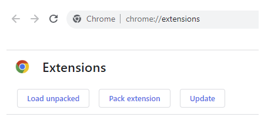

# yt-dislike-extension

# Goal

An extension to automatically show the dislike count for YoutuTube videos. When a video is opened, the count will be visible.
This extension uses the Return YouTube Dislike API (https://returnyoutubedislike.com/).
The dislike number or count is also formatted (for example it shows 1.3M instead of 1,300,300);

# Tools

The script is written in JavaScript and uses a MutationObserver to manipulate the DOM.

# Usage

To use the extension in Google Chrome, you can go to your extension menu and load the folder "extension" with the option "Load unpacked". To use the extension a refresh is needed.

# Visual

### Before

### After

### Gif

# Further improvements

/
